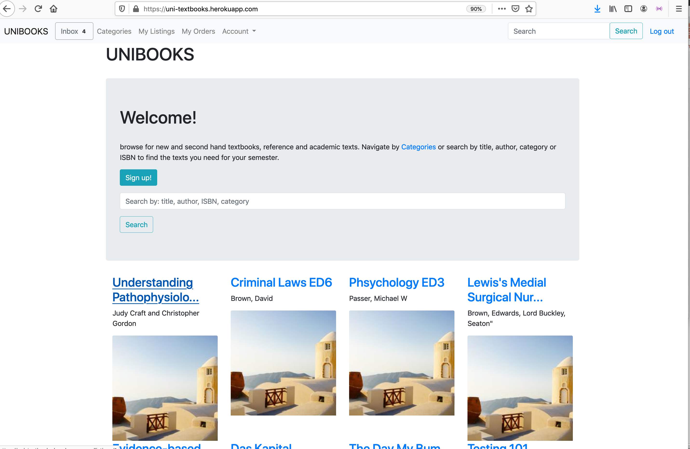

# README

live app available here: https://uni-textbooks.herokuapp.com/
Github repo: https://github.com/GorginZ/Book_marketplace

**To run this rails app in development**:

- Clone this repo or download as zip file

- Install the Postgresql app and ensure it is running: download and documentation available here: https://www.postgresql.org/
- create an AWS account https://aws.amazon.com/s3/  and a Stripe account, you will need credentials in order to utilize these features of the app. https://stripe.com/docs

- In terminal from the directory of the project run:

```
yarn install
```

```
bundle install
```

```
rails db:create
```

This creates a database

```
rails db:migrate
```

to run all of the migrations

```
rails db:seed
```

for some test data.

```
rails s
```

to start the local server. In your browser you can explore the app in development at http://localhost:3000/

Test admin user:
admin@test.com password: 123456

to explore as a regular user, just create one so you can checkout how the app runs while not signed in and the new_user pathway etc.


Explain the different high-level components (abstractions) in your App**

**Active Record** associations perform a number of critical high level functinos behind the scenes in my application. The declared associations between my active record models allow me to use the methods added to my models by these associations to manipuate objects in my database. One basic example is the dependent: :destroy association, which establishes a relation between one model and another, in my case Listings belongs_to :user.  This declared association means if a user is deleted the other objects in Listings model that are dependent on that user  are destroyed, which helps maintain order in the database and prevent orphaned listings.

Another useful example of how high level active record funcitons help my app run are the methods that come with the has_one_attached association. Listings and Category objects has_one_attached :picture. This association provides me with a scope I can call on those objects when I query the database to grab the pictures in my controller to feed to my views. I can call 

```
    @listings = Listing.where(available: true).with_attached_picture.all.limit(100)

```

in my show, and the with_attached_picture scope that comes along with the has_one_attached association allows me to reduce my database queries, because there is that association declared in my model.

The active record associations that exist between my models mean that when users create or edit listings, for instance if they edit the category of a listing, because of the active record association that exists between Listing and Category, the object is correctly updated in the database by SQL commands that will run when the edit action is executed.

Active recodrd associations are what allow for proper dynamic interaction and smooth operation and updating of my objects in reference and with respect to the appropriate relations and associations that need to exist for funcitnoality. 

A second example **Active Storage**, follows on from Active Record associations, as the scopes and methods discussed above allows me to access Active Storage attachments. I use active storage attachments to allow users to upload images through Amazon S3. Their uploads become associated with the object they are attaching it to and are able to be queried thorugh that association. The attachment is not in the database table like other attributes of a Listing like title, price etc, however. The way it works is this:  Active storage attachments create a polymorphic join table. It uses two tables, active_storage blobs and active_storage_attachments and it is through this association it is able to attach the file to the record. The SQL it spits out is like so: 

```
ActiveStorage::Attachment Load (0.5ms)  SELECT "active_storage_attachments".* FROM "active_storage_attachments" WHERE "active_storage_attachments"."record_type" = $1 AND "active_storage_attachments"."name" = $2 AND "active_storage_attachments"."record_id" IN ($3, $4, $5, $6, $7, $8, $9, $10, $11, $12, $13, $14, $15, $16, $17, $18, $19)
```

My config/environments/test.rb is configured such that my active_storage service is amazon as opposed to local, and so when an image is attached Active Storage generates URL for the file using access keys for the S3 bucket associated with my app.

**Action View**

Action views compiles the views associated with the actions in the controller it is associated to. Each controller will have it's own associated folder within the views directory, which allows for routing to and rendering of those views.

The views include templates, layouts and partials. Partials are handy and are htm.erb files that can be rendered in multiple views throughout the app. Temploates are directly associated with an action and must be routed correctly to render. The layouts allow us to specify certain view specifications perhaps for the whole application - as in the application.html.erb file, such as rendering a nav bar, or different views for different users, whether they are logged in or not etc. 


**Detail any third party services that your App will use**

I set up a S3 bucket with **Amazon Webservices** which is associated with my app. I configured my config/environments/production.rb as active_storage service = amazon, so my live heroku app allows files to be attached to certain records and is able to access those files through the active storage associations set up in my models. This is also discussed in some detail above. 

An additional third party service/gem I utilised is **Stripe**. Like AWS I had to configure this with my accounts master and secret keys. The stripe gem allows for mock/test card transactions in my app and in my payments_controller I followed stripe documentation for how to correctly pass the object params and stripe session ID. The metadata stripe uses to associate the transaction to the user is the current user's user_id and the listing in question's listing_id. I also created a second webhook endpoint so that stripe functions correctly in my deployed heroku app, as I noticed although stripe said everything was sucessful, the logic in my webhook was not executing, the listing was not renderd unavailable and the order was not created. This was a simple fix, though as I revised the documentation I simply needed to create an additional endpoint. Now my webhook action succesfully performs sql commands in my live app as well as locally - which saves the listings attribute available as false and it is no longer listed as an available listing, and also creates an order object associated with the listing id, and the user id of the buyer. 

Stipe and the logic associated with the webhook endpoint is essential for my apps full functionality and helps me manipulate data to appropiately reflect the intentions and uses of buyers and sellers using my app.

Likewise AWS provides a critical function by allowing users to add listings to advertise their listings visually.


**Identify the problem you’re trying to solve by building this particular marketplace App? Why is it a problem that needs solving?**

I've been a student at Monash uni the last 6 or so years, and thankfully most of the texts I needed were research papers, however it was impossible not to notice at the beginning and end of every semester hundreds of students posting on student facebook groups trying to sell or swap their extremely expensive textbooks, or waiting textbook in hand to meet a student infront of the library to hand over the book/cash. 

Libraries usually only hold one or two copies of an essential required text, and they may only be borrowed for a 7 or 14 day period. Most unis no longer have student run co-ops as student unions have become less relevant and more of booze-cruise organisers. 

It's annoying and expensive to buy and also re-sell textbooks as a student. My app aims to be a platform for uni-students to sell and also buy textbooks from other students across campuses across the country. This is particularly useful if a text is not particularly common/popular, as it widens the scope beyond a facebook uni gossip group. 

The idea is that students can search for relevant texts easily, Listings will be organised by category, title, author, keywords and ISBN and can be mailed to the buyer or picked up if appropriate. This app can contribute to making second hand textbook selling and buying a bit more convenient and more broadly acessable. 


**Describe your project’s models in terms of the relationships (active record associations) they have with each other**

Please also see code comments for how I implement the scopes and methods that come with certain associations I have declared between my models.

The **Listing** model belongs to user, which allows for a join table between a user and associated listings, which is useful, but also the additional dependent destroy association appended to belongs_to establishes a dependency relationship wherein if the user is deleted so are the listings. This is to help ensure only relevant and useful data remains in the database and no listings that have no user will be available to buy (which would obviously cause problems!)

The Listings also belongs_to a Category. I implemented this association over has_one becaue it allows for a join table between associated objects which can be useful for quering or searching in my database.

Listings also has_one :order. There is a one-to-one connection between listing and order. Each instance of order is associated with a single instance of listing.

```
class Listing < ApplicationRecord
    belongs_to :user, dependent: :destroy
    belongs_to :category 
    has_one :order
    has_one_attached :picture
end
```

**Category**

```
class Category < ApplicationRecord
  has_many :listings
  has_one_attached :picture
end
```

Category has many listings. A one-to-many connection with Listings.  It's the other side of Listings' belongs_to :category seen above. Each instance of Category may have many instances of Listings associated with that category instance. This association can help me query this association through a join table and find all listings associated with a given category.

**Order**

```
class Order < ApplicationRecord
    belongs_to :user
    belongs_to :listing
end

```

Order has one-to-one relations with User and Listing model. Order has exactly one user and one listing associated to each instance of order.

**User**

```
class User < ApplicationRecord
  devise :database_authenticatable, :registerable,
         :recoverable, :rememberable, :validatable
  has_many :listings
  has_many :orders
        
end

```

User has one-to-many associations with Listings and Orders model. Each user may have many Listings and Orders. I can use a join table to access these instances where associations exist in my database. for instance Order.joins(:user) allows me to see orders and associated data through an inner join table.

**Discuss the database relations to be implemented**

Key relations in my database to be implemented are as follows:

Listings will have a foreign key which will correspond to a User instance primary key, (user_id), associating a user to an instance of a listing.

Listings will also have a foreign key value which will correspond to a primary key value of an instance of Category. 

Orders will have a foreign key value that corresponds to a User primary key (user_id) and a foregn key that corresponds to a Listing primary key (listing_id).


These relations are visible and represented in the initial ERD schema design code below and in the final ERD imported from my complete project below. 


Below is original ERD code from my first day of planning the project and is my **database schema design**

                  ```//// -- LEVEL 1
    //// -- Tables and References
    
    // Creating tables
    Table users as U {
      id bigint [pk, increment] // auto-increment
      user_name string
      first_name string
      last_name string
      email varchar
      password varchar
      is_admin boolean
      created_at timestamp
    }
    
    Table listings{
      id bigint [pk, increment] // auto-increment
      title string
      ISBN bigint
      author string
      category integer
      keywords text
      user_id bigint
      available boolean
      visible boolean
      created_at timestamp
    }


​    
    Ref: "users"."id" < "listings"."user_id"
    
    Table orders{
      id bigint [pk, increment] // auto-increment
      user_id bigint
      listings_id bigint
      created_at timestamp
    }


​    
    Table messages{
      id bigint [pk, increment] // auto-increment
      receipient_id bigint [ref: > users.id]
      body text 
      sender_id bigint [ref: > users.id]
      created_at timestamp
    }
    
    Table categories{
      id bigint // auto-increment
      name string 
      created_at timestamp
    }


​    
    Ref: "orders"."listings_id" - "listings"."id"
    
    Ref: "orders"."user_id" < "users"."id"
    
    Ref: "categories"."id" < "listings"."category"


I did not implement a messaging system, for lack of time (as in initial ERD plan). but in the end my initial plan was how I established my database relations and provide the functionality I had hoped for. The image above is the ERD imported from my finished app schema. The primary key values say varchar, however they ar all integers (unsure of why they come up like that when imported to db diagram).


**Provide User stories for your App**

as a student I'm generally pressed for cash, and university compulsory text books are expensive. Often students use university social Facebook groups to sell text books and have to meet up on campus at the beginning or end of semester. A web app that creates a forum where users can list and buy from across the country and send and receive texts by post opens this up for wider accessability to second hand texts.
**Users broadly:**

- I want to be able to brows the app easily to explore the features available before creating an account and signing up
- I want my account to be easily manageable with options to change or update my password so I can feel in control of my account and security.
- I want to feel confident my information and privacy is being treated appropriately and in accordance with laws around personal information such as handling of credit card details and my contact details and only hand over information that is necessary for my own use of the services ( for example, assurance that my password or card details are handled by a trusted third party group that I can read about if I choose )
- be able to lodge grievances or get help in the instance something doesn't work out for me

**When selling:**

- I want simple listing forms so I can easily add a listing's title, author and category and I want to be able to update or change my listing if necessary
- I want to easily manage and view my listings with clear differentiation between sold and unsoldI want to be able to communicate with a buyer
- I want to be able to list pick-up options, incase the buyer is local and that is preferable

**When purchasing:**

- I want to be able to easily brows for texts and see what is available **before** making an account so I don't have to waste time incase I'm not interested or what I want isn't available. 

- 

- I want a comprehensive functional search function so I don't have to manually navigate through listings and categories

- I want to be able to communicate with who I am buying from

- I want my orders to be visually confirmed after a transaction so I feel assured my purchase has been successful, for instance re-directing to a page of my orders after transaction completed.

- I want a basic level of protection when purchasing, I want to be able to raise an issue with an administrator if I did not recieve an item or have an issue, if I am unable to resolve this with the seller I'd like to know I may be able to make a complaint or have an issue resolved with support.


  I was not able to implement every element of my user stories, but have left them all here nonetheless as I feel they are important considerations for this style of app. I feel confident most of the bare necessities of my user stories were met and they guided how I prioritised implementing features throughout the project.

  

**Describe the way tasks are planned and tracked in your project**

I utilised Trello throughout the duration of the project - the board is availble here where all the different deadlines and checked off things can be viewed in full: https://trello.com/b/atUDzCoU/rails-marketplace . I utilised Trellos deadlines and checklist features to help breakdown my goals into smaller tasks and each evening would adjust the cards with any new problems to solve, or to clearly break something down into a seperate task - to prevent myself trying to work on multiple features at once ( or in the same branch ). Usually a card is represented by an equiviallent branch on my git repo, as I tried to use the cards as a way to implement a feature on the ruberic or a problem I was facing and keep everything compartmentalised and keep a focused approach to my planned features. This helped me prioritise and implement features in an appropriate order and leave things like styling or additional features until the very end by reminding me what needed to be prioritised.


**ERD provided represents a normalised database model**

​                  ERD is provided above, both original erd code schema plan and a visual ERD of finished product representing the schema of final product.

**Ruberic criteria below this point is all addressed in code itself or code comments or not approriate to answer in read me.** 


**Authorization****

I used cancancan for authorisation in my app. An example of how this helped me create different restrictions for users with regard to what they can see and edit etc. is the restrictred access to *Category* methods. Only Admin users can use C R U D methods on Categories. This is because the categories that exist are what users will select from when they create a listing when they declare the category of their listing, so it's important they are not duplicated. The Category model exists mostly to ensure easy browsing and to provide another attribute for the search function, and so if Admins are able to edit and add categories accordingly, to do with popularity or to accomidate for certain types of listings, this is a good way to make that easy to manage. 
With regards to moderation, it also means that admins can remove or edit anything inappropriate or correct errors.

 https://github.com/CanCanCommunity/cancancan/wiki/Authorizing-controller-actions

R6. I deployed my app through heroku initially after creating it. I utilised auto-deploy so my app was built after each push to my master on my github Repo, this allowed me to check it was always working.